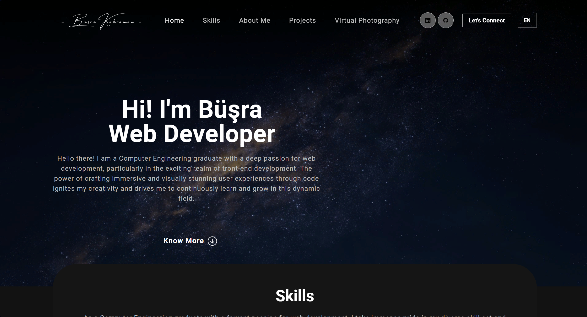

# Personal Portfolio

This project is a personal portfolio website showcasing my skills, projects, and more. It was built using React and React Bootstrap for responsive design. The website is available in both English and Turkish thanks to the integration of React i18next.

()

## Features

- Responsive design using React Bootstrap.
- Multilingual support (English and Turkish) with React i18next.

## Inspiration

This project was inspired by [Webdecoded](https://www.youtube.com/watch?v=hYv6BM2fWd8).
